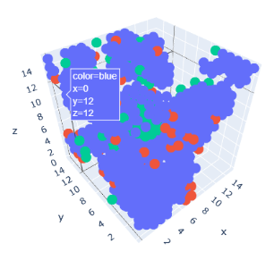

# Enzyme Stability


## Introduction
Enzymes are biological catalysts that speed up chemical reactions without being consumed or altered. They are widely used in various industries, such as food, pharmaceutical, textile, and biofuel, to improve the efficiency and quality of the products. However, enzymes are also sensitive to environmental factors, such as temperature, pH, and ionic strength, that can affect their structure and activity. Therefore, enzyme stability is an important factor in the industrial use of enzymes. In this report, we present the results of our team’s research on enzyme stability and immobilization.

## AVGP3
At the beginning, we noticed that the approach described in the [notebook](https://www.kaggle.com/code/vslaykovsky/nesp-thermonet) gives a high contribution to the prediction of thermal stability.

We studied the material from this article https://journals.plos.org/ploscompbiol/article?id=10.1371/journal.pcbi.1008291 and decided to experiment with different neural network architectures, and arrived at the Resnet-3D

Then we wondered which parts of the network really affect the result. By iteratively pruning the network we came up with a fairly simple architecture:

``` py
def forward(self, x):
    x = x.mean(axis=(2,3,4))
    return -x[:,3]
```

The same shape as for the Thermonet work was used as the input, (14,16,16,16).
Thus, averaging a single parameter `hbond_donor` (hydrogen bond donor) yielded a fairly high result.

To improve the metrics, we built different variations of feature descriptors using the `molekulekit` utility. 
This model, which we called **AVGP3**, became a part of our final ensemble solution.

## Rosetta
Thanks to the [notebook](https://www.kaggle.com/code/oxzplvifi/deletion-specific-ensemble) we noticed that thermal stability is also well predicted by Rosetta scores.

By combining the two methods into an ensemble (0.5 rosetta + 0.5 AVGP3), we improved our model.

Next, the AVGP3 result was combined with the [notebook](https://www.kaggle.com/code/oxzplvifi/deletion-specific-ensemble) with weights 0.2 and 0.8 and further improved our model.

We then proceeded to examine what Rosetta Scores success consists of. After the relaxation procedure, the pdb files contain POSE_ENERGIES_TABLE at the bottom


which consists of 20 parameters and weights to them, and we used them in our approach.

## Ranked rosetta

The idea emerged to use the weights for the ensemble. Independent predictions of thermostability were created for each parameter separately for all mutations, and then combined into an ensemble using the weights from POSE_ENERGIES_TABLE 

In fact, we have replaced 
```rankdata(w1*fa_attr + w1*fa_rep + …)```
 on
```w1*rankdata(fa_attr) + w2*rankdata(fa_rep)  … ```

We call this ensemble **RankedRosetta**

Combining this result with the best ensemble we got 0.615 on the public lb.

## Final ensemble

Finally, another [result](notebooks/eda-novozymes-enzyme-stability-6d10b0.ipynb) is added to the ensemble.

As we can see, the thermostability in both cases was significantly affected by Rosetta Scores throughout the molecule and the average of the hydrogen bond donor parameter in the vicinity of the mutation.
